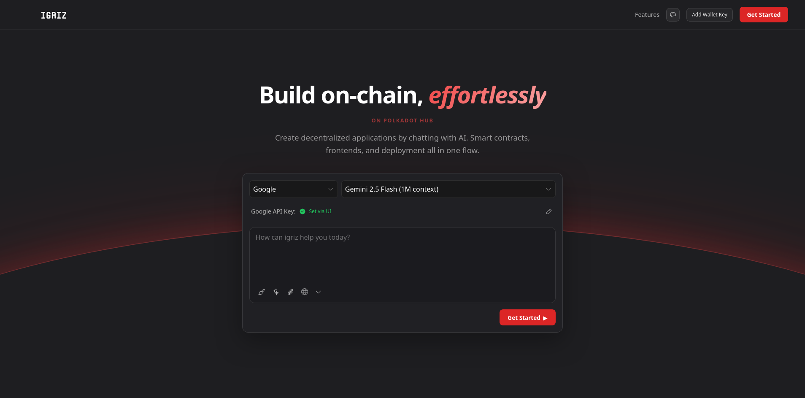
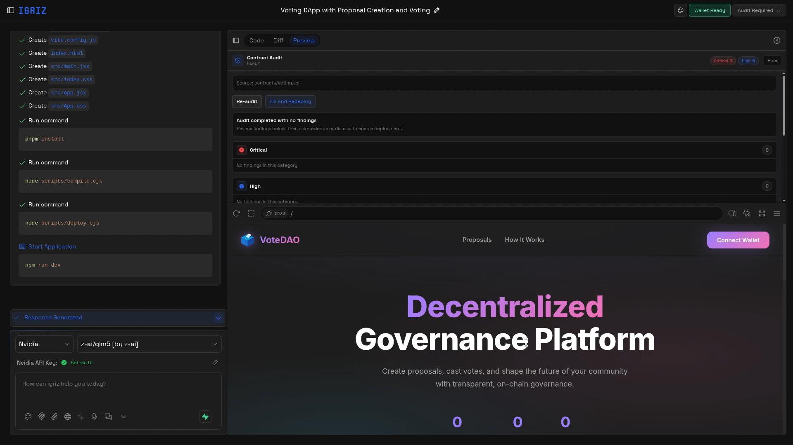
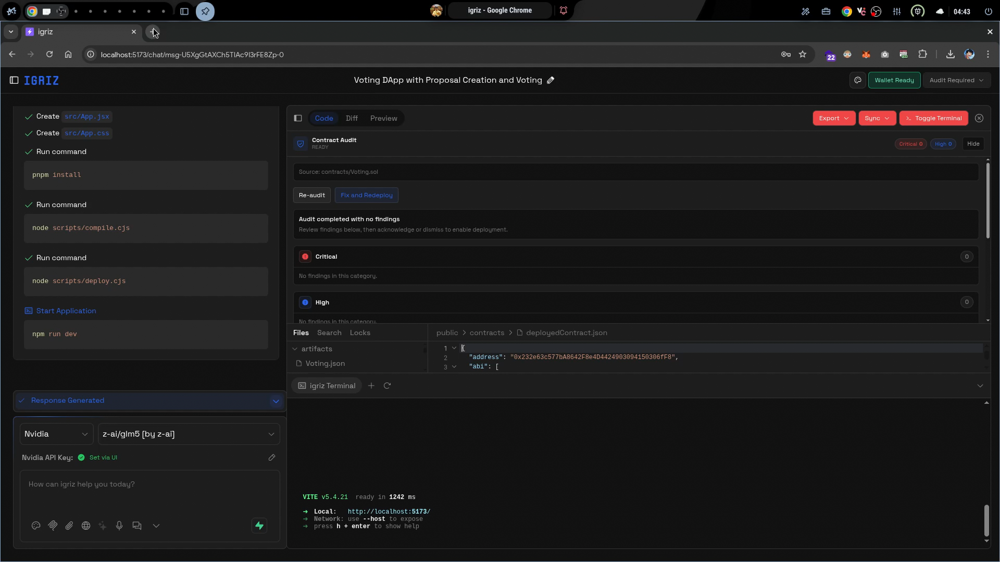
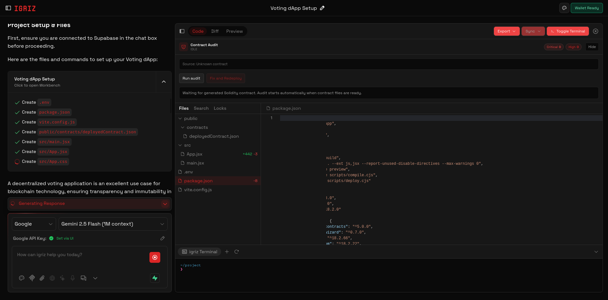
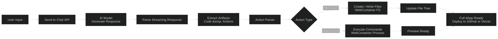
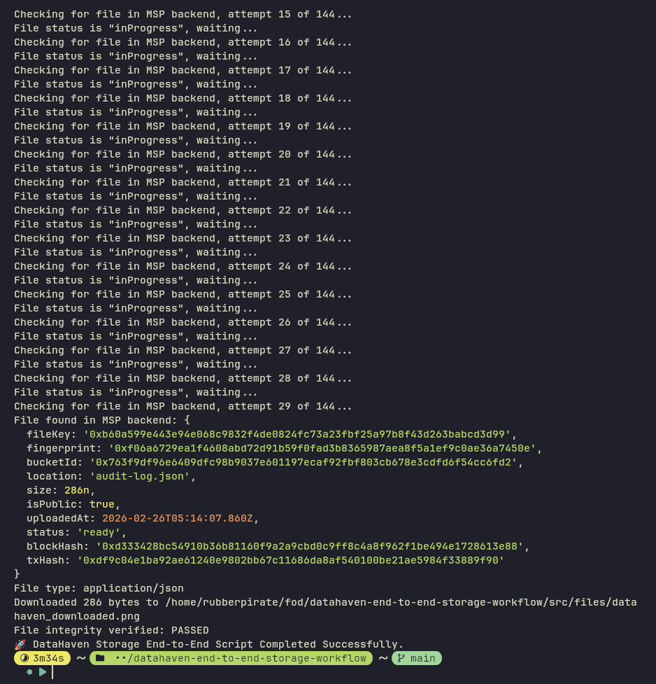
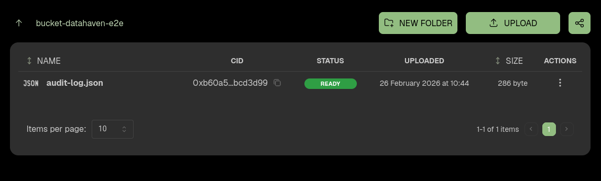

<p align="center">
  
</p>

# Igriz

Build decentralized applications on Quai Networks through conversational AI. From smart contract generation to production deployment, Igriz automates the entire dApp development lifecycle.

<table>
  <tr>
    <td></td>
    <td></td>
  </tr>
  <tr>
    <td></td>
    <td></td>
  </tr>
</table>

## Overview

Igriz is an AI-powered dApp builder that transforms natural language prompts into fully functional blockchain applications. Write a simple 5-word prompt, and Igriz generates production-ready Solidity smart contracts, React frontends, and handles deployment—all within your browser.

**Website:** [igriz.io](https://igriz.io)
**Network:** Quai Networks (Orchard - Cyprus1 Shard)

## Core Capabilities

### Smart Contract Generation

Write contracts in plain English. Igriz generates production-grade Solidity code with:
- Automated security best practices
- OpenZeppelin standard library integration
- Event emissions and state management
- Gas-optimized bytecode compilation

**Example:** "Create an ERC20 token with a minting function restricted to the owner"
→ Generates complete, auditable Solidity contract

### Instant Blockchain Deployment

Deploy directly from the builder without command-line tools:
- Automated compilation via solc (JavaScript Solidity compiler)
- Direct deployment to Quai Network testnet/mainnet using quais SDK
- Contract address and ABI automatically saved
- Transaction verification via Quaiscan explorer

**Deployment Flow:**
```
Generated Contract → Compiled Artifacts → quais.ContractFactory
                                              ↓
                                    Quai Network RPC
                                              ↓
                                    Deployed Contract Address
```

### Frontend Code Generation

AI generates React + Vite frontends that connect to the deployed contract, integrate Pelagus, and handle reads/writes with proper UX states.

### Full-Stack Integration

The frontend imports deployment info, supports read-only access, connects wallets for transactions, and initializes the correct provider config.

## How It Works

<p align="center">
  
</p>

### 1. User Input: Natural Language Prompt

```
"Build me a staking dApp with reward distribution"
```

### 2. AI Processing (Streaming)

The prompt is sent to the AI engine (Groq, OpenAI, or Google) which streams back structured responses:

```
Generated artifacts include:
├─ Solidity contracts
├─ Package dependencies
├─ Compilation scripts
├─ Deployment scripts
├─ Frontend React components
└─ Configuration files
```

### 3. Message Parsing & Action Extraction

The streaming response is parsed in real-time to extract:

**File Actions**
- Smart contract files (.sol)
- Frontend components (.jsx, .tsx)
- Configuration files (package.json, .env)
- Build scripts

**Shell Actions**
- npm install (dependency installation)
- Compilation commands
- Deployment commands
- Development server startup

### 4. Parallel Execution

Files are written simultaneously to WebContainer, while shell commands execute sequentially:

```
File Operations (Parallel)          Shell Commands (Sequential)
├─ Staking.sol ──┐                  ├─ npm install ──┐
├─ App.tsx ──────┼─→ Write to      │  (waiting...) │
├─ utils.ts ─────┤   WebContainer   │                │
└─ style.css ────┘                  └─ npm run dev ──→ Server Running
                                        (Port 5173)
```

### 5. Live Deployment & Preview

```
Smart Contract           Frontend
     ↓                      ↓
  Deploy to Quai ←→ WebContainer Dev Server
     ↓                      ↓
Contract Address    Live Preview (Port 5173)
  + ABI Data           + Wallet Connection
     ↓_____________________↓
         Full dApp Ready
```

## Quai Network Integration

### Contract Deployment via Hardhat Alternative

Since Hardhat v2.23+ requires Node.js 22+ (incompatible with WebContainer's Node.js v20), Igriz uses `solc` for compilation and `quais.ContractFactory` for deployment. Compilation outputs ABI/bytecode to artifacts and skips when valid; deployment generates an IPFS hash, handles sharded routing, and writes deployment info:
```json
{
  "address": "0x...",
  "abi": [...],
  "chainId": 15000,
  "rpcUrl": "https://orchard.rpc.quai.network",
  "deployed": true
}
```

### Key Configuration Details

**RPC:** `new quais.JsonRpcProvider(rpcUrl, undefined, { usePathing: true })`

**Skip behavior:** compile skips when artifacts exist; deploy skips when `deployedContract.json` is valid. Delete artifacts or the JSON file to force rerun.

**Network:** Quai is EVM-compatible (Cyprus1 shard, chain ID 15000). Always use `quais`, not ethers.js.

## Audit Logging & Security

### Contract Audit Trail (DataHaven Integration)

Igriz stores immutable audit logs in DataHaven, including the prompt, generated code hash, deployment tx hash, contract address, and timestamps. Records are retrievable by contract address for compliance and provenance.

<table>
  <tr>
    <td></td>
    <td></td>
  </tr>
</table>

### Built-in Security Practices

Generated contracts follow SPDX licensing, OpenZeppelin patterns, checks-effects-interactions, and emit events for state changes. Reentrancy guards and custom errors are used where applicable.

## Getting Started

### Prerequisites
- Modern web browser (Chrome, Firefox, Safari, Edge)
- Pelagus wallet extension (for contract interaction)
- Quai testnet tokens (for deployment gas)

### Installation

Clone and set up locally:

```bash
git clone https://github.com/yourusername/igriz.git
cd igriz
pnpm install
```

### Configuration

**Environment Variables** (.env.local):

```env
# LLM Provider Keys
GROQ_API_KEY=your_groq_key
OPENAI_API_KEY=your_openai_key
GOOGLE_API_KEY=your_google_key

# Quai Network (optional if using existing account)
QUAI_PRIVATE_KEY=your_quai_private_key
QUAI_RPC_URL=https://orchard.rpc.quai.network

# Vercel Deployment (optional)
VERCEL_TOKEN=your_vercel_token

# DataHaven Integration (for audit logs)
DATAHAVEN_API_KEY=your_datahaven_key
```

### Development Server

```bash
pnpm run dev
```

Opens at http://localhost:5173

## How Contracts are Generated & Deployed

This is the compressed flow from prompt to live dApp:

1. **Prompt**: A short request like "Build me a voting DAO".
2. **Structured output**: Contract + scripts + frontend files are generated.
3. **Compile**: `node scripts/compile.cjs` creates ABI + bytecode in artifacts.
4. **Deploy**: `node scripts/deploy.cjs` uses `quais.ContractFactory` and writes `src/contracts/deployedContract.json`.
5. **Connect UI**: Frontend imports deployment info and connects through Pelagus.
6. **Audit log**: Prompt, code hash, tx hash, and address are stored in DataHaven.

## Use Cases

### DeFi Builders
Launch lending, DEXs, and staking with AI-generated contracts.

**Example Prompts:** "Create a staking pool with 20% annual rewards"; "Build a decentralized exchange with liquidity pools"; "Make a lending protocol with collateral requirements"

### NFT Creators
Build minting pages and marketplaces with ERC721/ERC1155 contracts.

**Example Prompts:** "Generate an NFT collection with 5000 supply and royalties"; "Create an NFT marketplace with bidding functionality"; "Build a whitelist minting page for my collection"

### Web3 Startups
Go from idea to deployed dApp fast and validate quickly.

**Example Prompts:** "Build me a voting DAO for governance"; "Create a token gating system for my community"; "Generate a yield farming protocol with multiple pools"

### Smart Contract Auditors
Verify provenance with prompt-to-deploy audit logs, on-chain tx references, and immutable DataHaven records.

## API Reference

### Chat Endpoint

**POST** `/api/chat`

Stream AI-generated dApp code and actions.

Request:
```json
{
  "messages": [
    {
      "role": "user",
      "content": "Build me a voting dApp"
    }
  ],
  "provider": "groq",
  "model": "mixtral-8x7b-32768"
}
```

Response: Server-sent events stream with artifacts and actions

### Deployment Endpoint

**POST** `/api/vercel-deploy`

Deploy frontend to Vercel.

Request:
```json
{
  "token": "vercel_token",
  "files": [
    {
      "file": "index.html",
      "data": "..."
    }
  ]
}
```

Response:
```json
{
  "success": true,
  "url": "https://my-dapp.vercel.app",
  "id": "prj_123"
}
```
