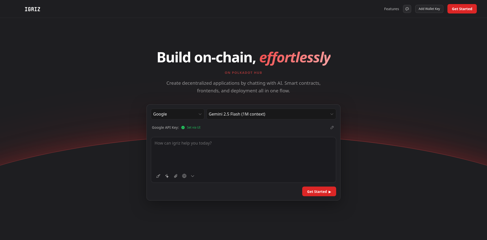
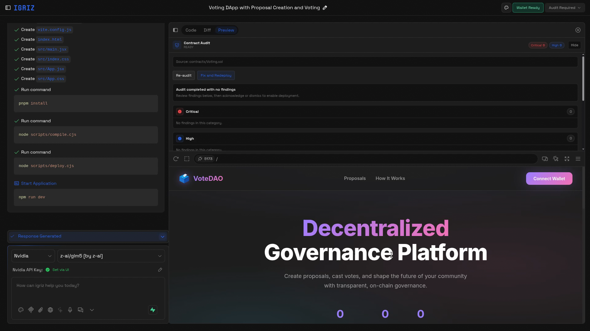
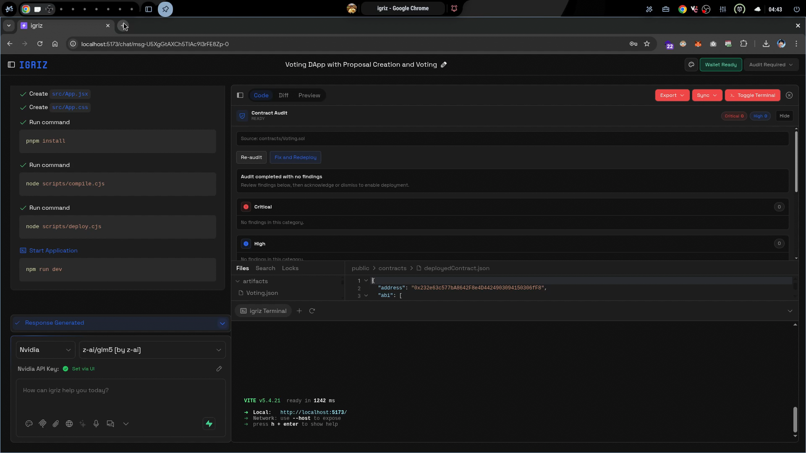
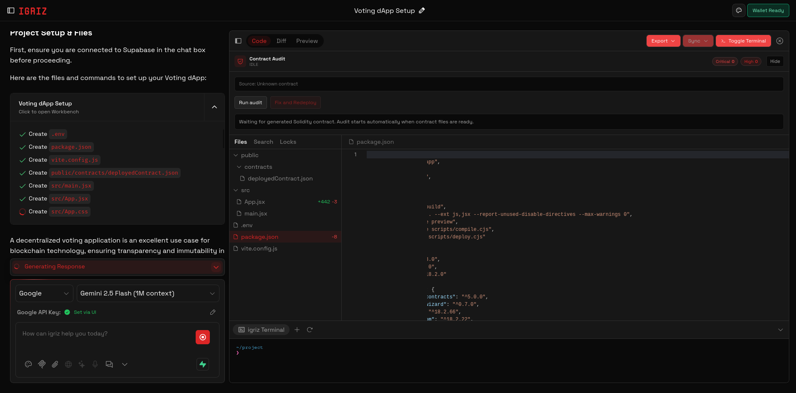
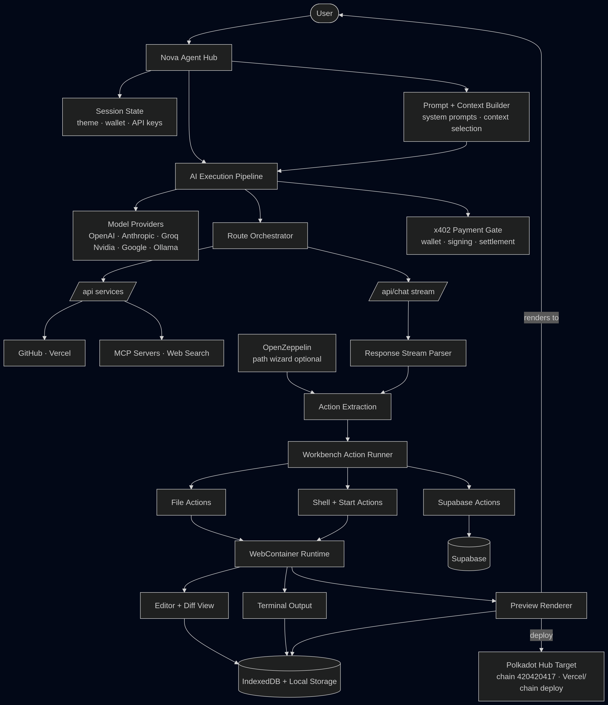

<p align="center">
  
</p>

# IGRIZ — AI dApp Builder for Polkadot Hub EVM

Igriz turns natural language prompts into fully deployable Polkadot Hub dApps inside your browser, no local toolchain needed.

Describe what you want to build. Igriz writes the Solidity contracts and frontend code, runs an automated security audit, and deploys to Polkadot Hub TestNet in one flow.

<table>
  <tr>
    <td></td>
    <td></td>
  </tr>
  <tr>
    <td></td>
    <td></td>
  </tr>
</table>

## Table of Contents

- [What This Project Does](#what-this-project-does)
- [What Makes Igriz Different](#what-makes-igriz-different)
- [Core Capabilities](#core-capabilities)
- [Target Network](#target-network)
- [Tech Stack](#tech-stack)
- [Architecture](#architecture)
- [How x402 Payments Work](#how-x402-payments-work)
- [API Endpoints](#api-endpoints)
- [Project Structure](#project-structure)
- [Getting Started](#getting-started)
- [Environment Variables](#environment-variables)
- [Scripts](#scripts)
- [Security Notes](#security-notes)
- [Deployment Notes](#deployment-notes)
- [Troubleshooting](#troubleshooting)

## What This Project Does

**Chat-to-code:** Describe a dApp in plain language. The AI streams Solidity + frontend code into a live in-browser WebContainer workspace with a file tree, editor, terminal, and preview.

**OpenZeppelin-aware audit:** Every generated contract is audited against OpenZeppelin best practices and security patterns. The AI flags deviations from OZ standards and suggests fixes using OpenZeppelin primitives — moving beyond boilerplate tokens toward meaningful application logic. Findings are bucketed by severity: critical, high, medium, low, and Polkadot-specific checks.

**Fix and redeploy:** One click applies the AI-suggested fix (with OpenZeppelin-aligned remediation), recompiles, and redeploys. Unresolved findings block deployment.

**Export:** Push to GitHub or deploy to Vercel directly from the UI.

The full chat-to-code loop:

1. User sends a prompt in chat.
2. LLM streams a response that can include `<igrizArtifact>` + `<igrizAction>` tags.
3. The parser extracts actions and sends them to an action runner.
4. File actions write to WebContainer FS, shell actions run in sequence.
5. Generated project appears in the integrated file tree/editor/terminal/preview.
6. Solidity code can be audited and automatically fixed/redeployed from the UI.

## What Makes Igriz Different

Most AI coding tools are pay-per-seat or require an API key tied to a subscription. Igriz uses the **x402 micropayment protocol** each message costs **$0.001 USDC**, settled instantly on-chain. No account, no subscription, no API key. You pay for exactly what you use, nothing more.

Your private key is held in memory for the session only. It is never written to disk, logged, or stored in any database.

This makes Igriz the first AI dApp builder with a fully on-chain, pay-as-you-go access model a product that eats its own cooking by using Web3 infrastructure to gate access to a Web3 tool.

## Core Capabilities

### 1) AI Generation with Provider/Model Selection

- Provider options: `Groq`, `OpenRouter`, `Google Gemini`, `Nvidia`, `Ollama`
- Server-side key fallback: `*_API_KEY` then `*_API_KEY_2`
- Streaming responses with continuation when max token segment is reached

### 2) In-Browser IDE

- File tree + editor + terminal + preview panes
- Live WebContainer filesystem syncing
- Multiple preview ports and terminal tabs
- Diff-aware prompt augmentation when user modifies files before next message

### 3) Solidity Audit Workflow

- `POST /api/audit` runs an LLM-based contract audit against OpenZeppelin best practices
- Returns structured severity buckets:
  - `critical`
  - `high`
  - `medium`
  - `low`
  - `polkadot`
- Audit panel auto-runs after generation settles and supports manual re-audit

### 4) Fix and Redeploy

- `POST /api/audit-fix` returns revised Solidity source from findings, with OpenZeppelin-aligned remediation
- UI action applies fix and queues:
  1. `node scripts/compile.cjs`
  2. `rm -f src/contracts/deployedContract.json && node scripts/deploy.cjs`

### 5) Export and Deployment Integrations

- GitHub token validation + repository/template operations
- Vercel token validation + direct deployment
- Deploy button can be blocked by unresolved audit acknowledgment state

## Target Network

```
Network:   Polkadot Hub TestNet
RPC:       https://services.polkadothub-rpc.com/testnet
Chain ID:  420420417 (0x1910E881)
Explorer:  https://blockscout-testnet.polkadot.io/
```

> Polkadot Hub EVM supports contracts up to **100KB** (vs Ethereum's 24KB limit), making it well-suited for the kind of feature-rich contracts Igriz generates.

## Tech Stack

- **Remix + React + TypeScript**
- **WebContainer** (in-browser Node.js runtime)
- **OpenZeppelin contracts** (audit reference + fix suggestions)
- **LLM providers:** Groq, OpenRouter, Google Gemini, Nvidia, Ollama
- **x402** for micropayment gating
- **Chat persistence** on Supabase and IndexedDB
- **Deployed on Vercel**

## Architecture

<p align="center">
  
</p>

### Frontend

- Remix + React + TypeScript
- Nanostores for state (`chat`, `provider`, `workbench`, `wallet`, `audit`, `github`, `vercel`)
- UI modules:
  - `app/components/chat`
  - `app/components/workbench`
  - `app/components/header`
  - `app/components/landing`
  - `app/components/sidebar`

### Runtime (WebContainer)

- `StreamingMessageParser` parses assistant output and extracts actions
- `ActionRunner` executes shell/file actions sequentially
- `FilesStore` watches filesystem changes and tracks user edits
- `PreviewsStore` listens for open ports and populates preview dropdown

### Server

- Remix action routes in `app/routes/api.*.ts`
- Chat handler in `app/lib/.server/actions/chat.ts`
- LLM abstraction in `app/lib/.server/llm/*`
- x402 enforcement in `app/lib/.server/x402.ts`

### Persistence

- IndexedDB chat history (`igrizHistory` DB, `chats` store)
- Supabase for extended chat persistence
- Route-based session restore via `/chat/:id`

## How x402 Payments Work

This app gates `POST /api/chat` behind x402 payment verification and settlement.

### Client Side

1. User enters a private key in `WalletButton`.
2. Key is stored in memory only (`walletStore`) and cleared on refresh.
3. `getX402PaymentFetch(privateKey)`:
   - normalizes key format (`0x` + 64 hex)
   - builds signer via `privateKeyToAccount`
   - wraps `fetch` using `wrapFetchWithPayment(...)`
4. Chat requests use this wrapped fetch when available.

### Server Side

`chatAction` calls `enforceX402ForChat(request, env)` before processing messages.

Flow inside `enforceX402ForChat`:

1. Resolve config from runtime env and `.env.local`/`.env`.
2. If `X402_ENABLED` is false, allow request.
3. If enabled:
   - Initialize x402 HTTP resource server
   - Register payment requirements for `POST /api/chat`
   - Validate payment header (`PAYMENT-SIGNATURE` or `X-PAYMENT`)
4. If payment is missing/invalid, return payment-required response.
5. If valid, process settlement and return settlement headers.
6. Chat stream response includes settlement headers.

### x402 Defaults in This Codebase

- Chat route identifier: `POST /api/chat`
- Default price: `$0.001`
- Default network: `eip155:84532` (Base Sepolia)
- Default facilitator: `https://x402.org/facilitator`

> **Note:** The **payment rail default network** (`eip155:84532`, Base Sepolia) is independent from the **generated dApp target network** (Polkadot Hub TestNet `420420417`). This is why payment errors in chat mention Base Sepolia USDC requirements.

## API Endpoints

| Route | Method | Purpose |
| --- | --- | --- |
| `/api/chat` | `POST` | Main generation stream, x402-gated when enabled |
| `/api/enhancer` | `POST` | Prompt enhancement stream |
| `/api/check-env-key` | `GET` | Checks whether a provider API key is configured |
| `/api/configured-providers` | `GET` | Returns providers that are currently configured |
| `/api/models` | `GET` | Returns provider/model catalog for the model picker |
| `/api/models/:provider` | `GET` | Returns models for a specific provider |
| `/api/audit` | `POST` | Audits Solidity source and returns structured report |
| `/api/audit-fix` | `POST` | Generates fixed Solidity source from report |
| `/api/github-user` | `GET`, `POST` | Validates GitHub token and serves repo-related actions |
| `/api/github-branches` | `GET`, `POST` | Fetches repository branches for GitHub workflows |
| `/api/github-template` | `GET` | Fetches template repository files |
| `/api/vercel-user` | `GET`, `POST` | Validates Vercel token and lists projects |
| `/api/vercel-deploy` | `GET`, `POST` | Creates deployments and fetches deployment details |
| `/api/export-api-keys` | `GET` | Exports locally stored API keys |

## Project Structure

```text
app/
  components/
    chat/            # chat UI, parser integration, provider selector
    workbench/       # editor, file tree, preview, terminal, audit panel
    header/          # deploy/export controls
    landing/         # marketing + launch UI
    sidebar/         # chat history
    wallet/          # in-memory private key input
  lib/
    .server/
      actions/       # chat, enhancer, audit, audit-fix
      llm/           # model/provider/key handling, system prompts
      x402.ts        # payment gate and settlement
    runtime/         # message parser + action runner
    stores/          # nanostore state modules
    persistence/     # IndexedDB chat history
    webcontainer/    # boot + prebuilt dependency mounting
    x402/            # client payment fetch wrapper
  routes/            # Remix routes and API endpoints
  styles/
  types/
  utils/

functions/
  [[path]].ts        # Cloudflare Pages adapter
```

## Getting Started

### Prerequisites

- Node.js `>= 18.18.0`
- Bun `>= 1.2.0` (root project package manager)

### Install

```bash
bun install
```

### Run Development Server

```bash
bun run dev
```

Then open the local Remix URL shown in terminal.

## Environment Variables

Create `.env.local` (or `.env`) in project root.

### LLM Providers

```env
GROQ_API_KEY=
GROQ_API_KEY_2=
OPENROUTER_API_KEY=
OPENROUTER_API_KEY_2=
GOOGLE_GENERATIVE_AI_API_KEY=
GOOGLE_GENERATIVE_AI_API_KEY_2=
```

### x402

```env
X402_ENABLED=true
X402_PAY_TO=
X402_CHAT_PRICE_USD=$0.001
X402_NETWORK=eip155:84532
X402_FACILITATOR_URL=https://x402.org/facilitator
X402_FACILITATOR_BEARER_TOKEN=
```

> **Notes:**
> - `X402_PAY_TO` is required when `X402_ENABLED=true`.
> - If using Coinbase CDP facilitator URL, bearer auth may be required; code falls back to public facilitator when missing.

## Scripts

| Command | Description |
| --- | --- |
| `bun run dev` | Start Remix dev server |
| `bun run build` | Build app |
| `bun run start` | Run built server |
| `bun run test` | Run Vitest suite |
| `bun run lint` | Run ESLint |
| `bun run typecheck` | Run TypeScript check |

## Security Notes

- Wallet private key in `WalletButton` is memory-only and not persisted to disk.
- GitHub and Vercel tokens are persisted in `localStorage` to keep sessions connected.
- Deploy actions can be blocked by unresolved audit acknowledgment state.
- Server returns explicit error surfaces for auth/quota/rate-limit/payment failures.

## Deployment Notes

- `vercel.json` is configured with Remix framework and COEP/COOP headers.
- `functions/[[path]].ts` provides a Cloudflare Pages handler, so codebase supports edge-oriented runtimes.
- Local project scripts use `bun`; Vercel config also uses `bun` commands for install/build.
